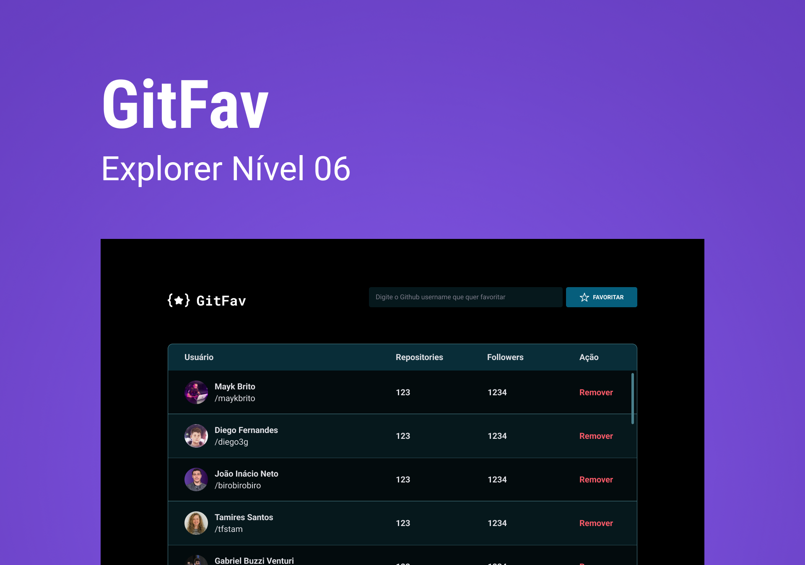

<h1 align="center"> GitFav </h1>

  <a href="#-tecnologias">Tecnologias</a>&nbsp;&nbsp;&nbsp;|&nbsp;&nbsp;&nbsp;
  <a href="#-projeto">Projeto</a>&nbsp;&nbsp;&nbsp;&nbsp;&nbsp;&nbsp;</a>

 

  

## 🚀 Tecnologias

- HTML e CSS
- JavaScript
- Github API

## 💻 Projeto

GivFav busca usuários do GitHub por API e mostra no seu favoritos. Projeto desenvolvido por mim para o desafio da semana 06 da Rocketseat Explorer. Treino do conceito SPA + API, JavaScript Puro, Async, Promise, etc..

---

Feito com ♥ by Brian Rangel [LinkedIn](https://www.linkedin.com/in/brianrangel/) e [GitHub](https://github.com/xumbreks)